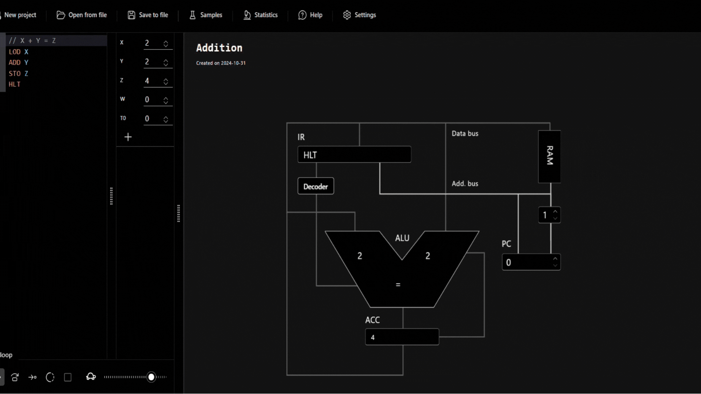

<h1 align="center">
    <a>
        
    </a>
</h1>
<div style="display: inline-block;">
 
 

</div>
<br>
<p style="font-size:120%;" align="center">
    <a href="#Introdução">Introdução</a> -
    <a href="#estrutura do projeto">Estrutura do Projeto</a> -
    <a href="#arquivos">Arquivos</a> -
    <a href="#Detalhemento do Código">Detalhemento do Código</a> -
    <a href="Testes e Análises dos Resultados">Testes e Análises dos Resultados</a> -
    <a href="#Conclusão">Conclusão</a> -
    <a href="#Compilação e Execução">Compilação e Execução</a> -
    <a href="#Contatos">Contatos</a>
</p>

 <div align="justify">

## Introdução

O objetivo deste projeto é desenvolver um sistema operacional simplificado utilizando a linguagem C, que se caracteriza por seu baixo nível de abstração e alto controle sobre os recursos de hardware. Este trabalho acadêmico, proposto pelo professor <a href="https://github.com/mpiress" target="_blank">Michel Pires</a> (CEFET/MG), foi realizado para oferecer uma compreensão dos conceitos fundamentais de sistemas operacionais, como gerenciamento de processos, controle de memória e interação com dispositivos de entrada e saída. A escolha da linguagem C permite uma experiência prática de como os sistemas operacionais gerenciam diretamente os recursos de hardware, proporcionando uma visão detalhada da arquitetura de computadores.


 ## Arquitetura de Von Neumann
Também conhecida como Modelo de Princeton, a Arquitetura de von Neumann tem seu elemento principal na possibilidade dos dados serem executados e armazenados de maneira uniforme. Em outras palavras, o sistema deve conseguir realizar todo o seu processo de cálculos harmonicamente por meio do envio e recebimento de dados e instruções.

#### Unidade Central de Processamento (CPU)
Popularmente conhecida como processador, a CPU é o componente primordial de todo computador, pois é o responsável direto pelo cálculo, interpretação e execução das demandas em uma máquina. Em seu interior, a Arquitetura de von Neumann elenca três subdivisões importantes para seu funcionamento:

##### Unidade Lógica e Aritmética (ULA): 
É o segmento que realiza as operações matemáticas da CPU, como uma calculadora embutida nesse componente;

##### Unidade de Controle:
A unidade de controle tem como missão garantir que todos os processos sejam executados corretamente e de maneira organizada;

##### Registradores:
Para armazenar temporariamente dados durante operações, a ULA possui registradores internos. Esses registradores são pequenas áreas de armazenamento de alta velocidade que permitem que a ULA realize suas operações de maneira eficiente.

#### Memória
A memória é um componente crucial na arquitetura de Von Neumann, sendo o local onde dados e instruções são armazenados para serem utilizados durante a execução de programas. Na concepção de Von Neumann, a memória é um recurso unificado, armazenando tanto as instruções do programa quanto os dados manipulados por essas instruções.
Uma característica fundamental da arquitetura de Von Neumann é a coexistência de instruções e dados na mesma memória. Isso significa que as instruções do programa e os dados são armazenados de maneira intercalada, possibilitando a flexibilidade na execução de diferentes tarefas.Durante o ciclo de instrução, a Unidade de Controle coordena o acesso à memória para buscar instruções e dados necessários à execução. A memória fornece essas informações para a Unidade de Controle, que as encaminha para a Unidade Lógica e Aritmética ou outros componentes, conforme necessário.

##### Memória Principal (RAM):
Responsável por armazenar dados temporários e instruções em uso durante a execução do programa. A RAM é volátil, ou seja, perde seu conteúdo quando a energia é desligada.

##### Memória Secundária (Armazenamento):
Utilizada para armazenar dados de forma persistente, mesmo quando o computador está desligado. Exemplos incluem discos rígidos (HDDs) e unidades de estado sólido (SSDs).


##### Hierarquia de Memória:

Os sistemas modernos muitas vezes implementam uma hierarquia de memória para otimizar o desempenho. Caches de alta velocidade são utilizados para armazenar temporariamente dados frequentemente acessados, reduzindo a necessidade de acessar a memória principal mais lenta.

#### Unidade de Entrada/Saída (E/S)
Os dispositivos de input e output são os periféricos usados em um computador, ou seja, todo equipamento externo que usamos para controlar a máquina. O mouse, teclado...

##### Simulação da Arquitetura de Von Neumann utilizando o ADD
<p align="center">
 
</p>

## Pipeline MIPS

O pipeline simulado deve possuir quatro estágios:

* Busca de instrução: a busca de instrução é responsável por buscar a próxima instrução da memória de instruções, a próxima instrução é referenciada pelo valor do contador de programa (PC). A instução buscada deve ser colocada no registrador IR e o valor de PC deve ser atualizada para a instrução seguinte.
* Decodificação: a decodificação é responsável por determinar a operação da instrução, seus operandos fontes e destino e se existe a necessidade de (A, B ...) por causa da dependência de dados.
* Execução: a execução realiza a operação e o resultado é mantido temporariamente dentro do próprio pipeline por enquanto.
* Escrita de resultado: a última etapa escreve o resultado da etapa de execução de volta no registrador de destino, seja uma operação aritmética ou um salto, ou na memória, se for um store. Com exceção da etapa de execução, todas as outras etapas demoram um ciclo de clock para completar suas tarefas.


## Estrutura do Projeto

  De uma forma compacta e organizada, os arquivos e diretórios estão dispostos da seguinte forma:

  ```.
  |
  ├── dataset
  |   |   ├── program.txt
  ├── src
  │   │   ├── architecture.c
  │   │   ├── architecture.h
  │   │   ├── cache.c
  │   │   ├── cache.h
  │   │   ├── cpu.c
  │   │   ├── cpu.h
  │   │   ├── disc.c
  │   │   ├── dic.h
  │   │   ├── interpreter.c
  │   │   ├── interpreter.h
  │   │   ├── libs.h
  │   │   ├── main.c
  │   │   ├── peripherals.c
  │   │   ├── peripherals.h
  │   │   ├── ram.c
  │   │   ├── ram.h
  │   │   ├── reader.c
  │   │   ├── reader.h
  │   │   └── uthash.h
  ```

  ### Arquivos
  
  <div align="justify">
  
  Para a solução proposta os seguintes diretórios/funções foram utilizados: 
  
  - `dataset/program.txt` Arquivo em que se encontra as instruções de _entrada_; em txt.
  - `src/architecture.c`  Arquivo que inicializa componentes como CPU, RAM, disco e periféricos; carrega um programa na RAM, verificando se o tamanho é compatível com a capacidade da memória. Em seguida, verifica as instruções na RAM e realiza um pipeline de execução, onde cada instrução é buscada, decodificada, executada e, em seguida, os resultados são escritos de volta. 
  - `src/architecture.h`Funções principais para inicializar componentes (CPU, RAM, disco e periféricos)
  - `src/cache.c` Operações de gerenciamento de cache usando uma tabela hash. Ele permite adicionar `(add_cache)` e buscar `(search_cache)` entradas de cache com base no endereço, removê-las (remove_cache), exibir todo o conteúdo do cache `(print_cache)` e esvaziar a cache completamente `(empty_cache)`.
  - `src/cache.h` Estrutura básica para o gerenciamento de cache,  biblioteca `uthash` para criação e manipulação de uma tabela hash.
  - `src/cpu.c`  Implementa operações fundamentais para um emulador de CPU, incluindo a inicialização da CPU e de seus núcleos, execução de operações aritméticas por meio de uma unidade lógica aritmética (ULA), e manipulação de instruções para carregar e armazenar dados em registradores e memória RAM.
  - `src/cpu.h` Define a estrutura da CPU e de seus núcleos.
  - `src/disc.c` Inicialização de um "disco de memória", todos os valores são inicializados com zero, o que prepara o "disco" para ser utilizado em operações de leitura e escrita.
  - `src/disc.h` Define uma estrutura e uma função para gerenciar uma simulação de disco de memória.
  - `src/interpreter.c`  Uma implementação de um interpretador simples para um conjunto de instruções em uma "simulação" de um processador.
  - `src/interpreter.h`  Fornece as definições e declarações necessárias para validar e interpretar as instruções.
  - `src/libs.h` Arquivo de inclusão das bibliotecas utilizadas nos arquivos do sistema.
  - `src/main.c` Função principal que inicializa a arquitetura do sistema, incluindo a CPU, RAM, disco e periféricos. Ele carrega um programa em RAM a partir de um arquivo de entrada (dataset/program.txt), verifica as instruções carregadas, e inicia o pipeline de execução do programa. Após a execução, a função exibe o conteúdo da RAM e libera a memória alocada.
  - `src/peripherals.c` Inicializa os periféricos do sistema, configurando valores iniciais, como o valor de entrada, que é definido como zero.
  - `src/peripherals.h`Define a estrutura básica dos periféricos do sistema, incluindo o valor de entrada.
  - `src/pipeline.c` Implementa as etapas do pipeline de execução de instruções, incluindo busca (instruction_fetch), decodificação (instruction_decode), execução (execute), acesso à memória (memory_access) e escrita dos resultados (write_back). Cada etapa interage com a CPU e a RAM para processar instruções, gerenciar operações de carga e armazenamento, e atualizar registradores com os resultados das operações aritméticas.
  - `src/pipeline.h`  Declara as funções principais para o pipeline de execução de instruções, incluindo busca, decodificação, execução, acesso à memória e escrita de resultados.
  - `src/ram.c` Gerencia a inicialização e exibição do conteúdo da RAM. A função init_ram aloca memória para a RAM e inicializa cada posição com um caractere nulo ('\0'). A função print_ram exibe o conteúdo atual da RAM.
  - `src/ram.h` Define a estrutura e funções para o gerenciamento da memória RAM, incluindo a alocação e exibição de conteúdo. Especifica um tamanho máximo para a RAM (NUM_MEMORY) e declara as funções init_ram e print_ram.
  - `src/reader.c` Implementa funções para ler e manipular um programa a partir de um arquivo.
  - `src/reader.h`  Declara funções para a leitura e manipulação de um programa, incluindo a leitura do conteúdo de um arquivo (read_program), a extração de uma linha específica (get_line_of_program), a contagem do número total de linhas (count_lines), e a contagem do número de tokens em uma linha (count_tokens_in_line).
  - `src/uthash.h`  Implementação de tabelas hash em C.

## Detalhemento do Código e Lógica Utilizada

#### Instruções
 A execução de instruções em um sistema baseado na arquitetura de Von Neumann segue um ciclo característico, conhecido como ciclo de instrução. Esse ciclo consiste em quatro fases:
 Busca (Fetch): A unidade de controle busca a próxima instrução na memória principal.

* Decodificação (Decode): A instrução é decodificada para que a unidade de controle compreenda qual operação deve ser realizada.

* Execução (Execute): A instrução é executada pela unidade lógica e aritmética (ULA) ou outra unidade especializada.

* Armazenamento (Store): O resultado da execução pode ser armazenado de volta na memória ou em outro local apropriado.

 | Instrução | Descrição                                                                                  | Observações                       |
|-----------|--------------------------------------------------------------------------------------------|-----------------------------------|
| `LOAD`    | Carrega um valor de uma posição de memória para um registrador.                            | ---                               |
| `STORE`   | Armazena o valor de um registrador em uma posição de memória.                              | ---                               |
| `ADD`     | Soma os valores de dois registradores e armazena o resultado em um registrador.            | ---                               |
| `SUB`     | Subtrai o valor de um registrador pelo valor de outro e armazena o resultado.              | ---                               |
| `MUL`     | Multiplica os valores de dois registradores e armazena o resultado.                        | ---                               |
| `DIV`     | Divide o valor de um registrador pelo valor de outro e armazena o resultado.               | ---                               |
| `IF`      | Inicia uma instrução condicional.                                                          | ---                               |
| `ELSE`    | Define a alternativa a ser executada caso a condição de `IF` seja falsa.                   | ---                               |
| `LOOP`    | Inicia um loop, repetindo instruções até que uma condição seja atendida.                   | ---                               |
| `INVALID` | Instrução não reconhecida ou inválida.                                                     | ---                               |


 #### Simulação
A tabela abaixo fornece uma visão detalhada de cada instrução utilizada no exemplo de entrada. Para cada instrução, são especificados o propósito e o efeito no sistema. Isso permite uma compreensão clara das operações e facilita a análise do fluxo de execução do programa.

Cada instrução é responsável por realizar uma operação específica sobre os registradores e/ou posições de memória, permitindo a manipulação de dados conforme a lógica do programa. Abaixo estão os detalhes das instruções

| Instrução       | Descrição                                                                                       |
|-----------------|-------------------------------------------------------------------------------------------------|
| `LOAD A0 10`    | Carrega o valor `10` no registrador `A0`.                                                       |
| `LOAD B0 5`     | Carrega o valor `5` no registrador `B0`.                                                        |
| `LOAD C0 6`     | Carrega o valor `6` no registrador `C0`.                                                        |
| `LOAD D0 1`     | Carrega o valor `1` no registrador `D0`.                                                        |
| `ADD A0 B0`     | Soma o valor de `A0` com o valor de `B0` e armazena o resultado em `A0`.                        |
| `ADD C0 A0`     | Soma o valor de `C0` com o valor atualizado de `A0` e armazena o resultado em `C0`.             |
| `STORE C0 A189` | Armazena o valor de `C0` na posição de memória `A189`.                                          |
| `LOOP A0`       | Inicia um laço que executa as instruções internas enquanto `A0` for diferente de zero.         |
| `ADD C0 10`     | Adiciona o valor `10` ao registrador `C0`.                                                      |
| `L_END`         | Marca o final do bloco de loop.                                                                 |
| `IF D0 == 1`    | Executa o bloco `IF` se o valor de `D0` for igual a `1`.                                       |
| `ADD D0 3`      | Adiciona `3` ao valor do registrador `D0`.                                                      |
| `SUB A0 1`      | Subtrai `1` do valor do registrador `A0`.                                                       |
| `I_END`         | Marca o final do bloco `IF`.                                                                    |
| `ELSE`          | Executa um bloco alternativo se a condição `IF` não for satisfeita.                             |
| `ELS_END`       | Marca o final do bloco `ELSE`.                                                                  |
                                        

Para um melhor entendimento será apresentado uma breve descrição do funcionamento do Programa

* 1- Inicialização:
   *  A função principal em (src/main.c) é o ponto de entrada do programa. Ela inicializa todos os componentes da arquitetura do sistema, incluindo a CPU, RAM, disco e periféricos.
   *  O programa lê um arquivo de entrada (dataset/program.txt) que contém as instruções a serem executadas.

* 2- Leitura do Programa:
O arquivo é processado por funções implementadas em src/reader.c, onde:
   *  read_program lê o conteúdo do arquivo e o armazena.
   *  count_lines conta o número total de linhas no programa.
   *  get_line_of_program extrai linhas específicas do programa para execução.

*  3- Carregamento na RAM:
   *  O programa é carregado na RAM usando a estrutura definida em src/ram.c.
   *  O conteúdo da RAM é inicializado.

*  4- Pipeline de Execução:   
O programa entra em um loop de execução:
   *  Busca a instrução na RAM.
   *  Decodifica a instrução.
   *  Executa a operação.
   *  Acessa a memória, se necessário.
   *  Escreve os resultados de volta.


### Saída do Programa

A saída mostra, para cada instrução, o tipo, o resultado, e os valores dos registradores e memória envolvidos. Esse detalhamento permite a análise passo a passo do fluxo de execução.

- **Number of Instructions**: Mostra a quantidade total de instruções executadas.
- **Instruction**: Lista as instruções sequenciais e suas operações.
- **Type of Instruction**: Indica o tipo da operação executada (e.g., LOAD, ADD, LOOP, IF, etc.).
- **Result**: Exibe o resultado da operação, seja no registrador, na memória, ou uma verificação de condição.
- **Register/Memory Update**: Exibe os valores atualizados após a execução de operações como `ADD`, `SUB`, `STORE`, etc.

#### Exemplo de Saída:

```plaintext
Number of instructions: 18
Instruction 0: LOAD A0 10
Type of instruction: 0
Result: 0
Register A0: 10
Instruction 1: LOAD B0 5
Type of instruction: 0
Result: 0
Register B0: 5
Instruction 2: LOAD C0 6
Type of instruction: 0
Result: 0
Register C0: 6
Instruction 3: LOAD D0 1
Type of instruction: 0
Result: 0
Register D0: 1
Instruction 4: ADD A0 B0
Type of instruction: 2
Result: 15
WB: Register A0: 15
Instruction 5: ADD C0 A0
Type of instruction: 2
Result: 21
WB: Register C0: 21
Instruction 6: STORE C0 A189
Type of instruction: 1
Result: 0
Memory address 189: 21
Instruction 7: LOOP A0
Type of instruction: 8
Result: 0
...
Instruction 17: ELS_END
Type of instruction: 11
Result: 0
```

## Compilação e Execução

Um arquivo Makefile que realiza todo o procedimento de compilação e execução está disponível no código. Para utilizá-lo, siga as diretrizes de execução no terminal:

| Comando                |  Função                                                                                           |                     
| -----------------------| ------------------------------------------------------------------------------------------------- |
|  `make clean`          | Apaga a última compilação realizada contida na pasta build                                        |
|  `make`                | Executa a compilação do programa utilizando o gcc, e o executável vai para a pasta build          |
|  `make run`            | Executa o programa da pasta build após a realização da compilação                                 |

##  Referências

TANENBAUM, A. S.; AUSTIN, T. Structured Computer Organization. [S.l.], 2012. 800 p.


## Contatos

<div align="center">
   <i>JOAO MARCELO GONCALVES LISBOA Engenharia de Computação @ CEFET-MG</i>
<br><br>

[![Gmail][gmail-badge]][gmail-autor]
</div>

<div align="center">
   <i>RAFAEL AUGUSTO CAMPOS MOREIRA Engenharia de Computação @ CEFET-MG</i>
<br><br>

[![Gmail][gmail-badge]][gmail-autor2]
</div>

<div align="center">
   <i>VICTOR RAMOS DE ALBUQUERQUE CABRAL Engenharia de Computação @ CEFET-MG</i>
<br><br>

[![Gmail][gmail-badge]][gmail-autor3]
</div>

<div align="center">
   <i> YGOR SANTOS VIEIRA Engenharia de Computação @ CEFET-MG</i>
<br><br>

[![Gmail][gmail-badge]][gmail-autor4]
</div>

[gmail-badge]: https://img.shields.io/badge/-Gmail-D14836?style=for-the-badge&logo=Gmail&logoColor=white
[gmail-autor]: joaoeletricgl@outlook.com

[gmail-badge]: https://img.shields.io/badge/-Gmail-D14836?style=for-the-badge&logo=Gmail&logoColor=white
[gmail-autor2]:camposrafa806@gmail.com

[gmail-badge]: https://img.shields.io/badge/-Gmail-D14836?style=for-the-badge&logo=Gmail&logoColor=white
[gmail-autor3]:vramoscabral2020@gmail.com

[gmail-badge]: https://img.shields.io/badge/-Gmail-D14836?style=for-the-badge&logo=Gmail&logoColor=white
[gmail-autor4]:ygorvieira111@gmail.com

[^1]: TANENBAUM, A. S.; AUSTIN, T. **Structured Computer Organization**. [S.l.], 2012. 800 p.
